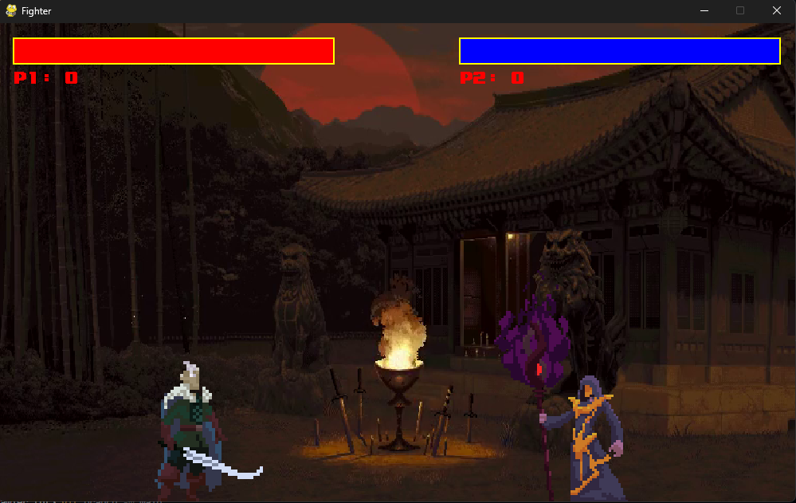
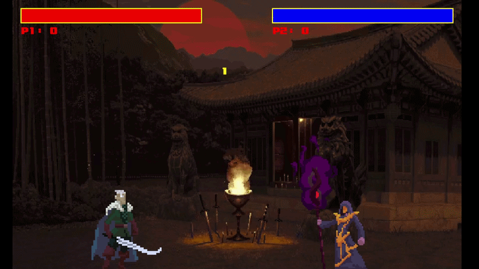

# PyGame Fighter - 2D Fighting Game

A fast-paced 2-player fighting game built with **Pygame** and **MoviePy**.  
Battle as the mighty **King** against the powerful **Wizard** in an arena with a dynamic video background!

  

## 🎮 Features

- **Two unique fighters**:
  - **King** – sword-based melee combat
  - **Wizard** – magic projectile attacks
- Smooth sprite animations (idle, run, jump, attack, hit, death)
- Health bars and score tracking
- 3-second countdown before each round
- Victory screen with automatic round restart
- Dynamic video background using MoviePy
- Background music and sound effects (sword swings + magic)

## 🛠️ Technologies Used

- **Python 3.11**
- **Pygame** – for game loop, graphics, input and audio
- **MoviePy** – for playing video as background
- **NumPy** – required by MoviePy for frame processing

## 📁 Project Structure
PyGame-Fighter/
├── main.py                 # Main game entry point
├── fighter.py              # Fighter class with animations and logic
├── assets/
│   ├── Audio/              # Background music and sound effects
│   ├── Images/             # Victory image, background video
│   ├── King Pack/          # King sprite sheet and data
│   └── Wizard/             # Wizard sprite sheet and data
├── .gitignore
└── README.md
text## 🚀 How to Run the Game

### 1. Clone the repository
```bash
git clone https://github.com/Darth-Freljord/PyGame-Fighter.git
cd PyGame-Fighter
2. Create and activate a Conda environment (recommended)
Bashconda create -n fighter-game python=3.11 -y
conda activate fighter-game

conda install -c conda-forge pygame numpy ffmpeg -y
pip install moviepy==1.0.3
3. Run the game
Bashpython main.py
Controls:
Player 1 (King - Left Side)

Move: AD
Jump: W
Attack: Space
Block: S (optional, depending on your fighter.py implementation)

Player 2 (Wizard - Right Side)

Move: ←→
Jump: ↑
Attack: Enter / Right Ctrl
Block: ↓

🎥 Video Background Note
The game uses a video file (assets/Images/Test1.mp4) as the animated background.
Make sure the video file exists in the correct path. The game will automatically loop the video.
📋 Requirements
All dependencies are listed above.
For a requirements.txt version (if you prefer pip only):
Bashpygame
numpy
moviepy==1.0.3
imageio-ffmpeg
🛠️ Future Improvements (Ideas)

Add more characters
Combo system and special attacks
Sound volume settings
Fullscreen mode
AI opponent for single player
Online multiplayer (using sockets)
Menu screen and character selection

📄 License
This project is open-source. Feel free to use, modify, and learn from it!

Made with ❤️ using Pygame
